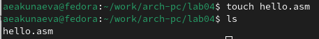
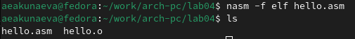

---
## Front matter
title: "Лабораторная работа №4"
subtitle: "Создание и процесс обработки программ на языке ассемблера NASM"
author: "Акунаева Антонина Эрдниевна"

## Generic otions
lang: ru-RU
toc-title: "Содержание"

## Bibliography
bibliography: bib/cite.bib
csl: pandoc/csl/gost-r-7-0-5-2008-numeric.csl

## Pdf output format
toc: true # Table of contents
toc-depth: 2
lof: true # List of figures
lot: true # List of tables
fontsize: 12pt
linestretch: 1.5
papersize: a4
documentclass: scrreprt
## I18n polyglossia
polyglossia-lang:
  name: russian
  options:
	- spelling=modern
	- babelshorthands=true
polyglossia-otherlangs:
  name: english
## I18n babel
babel-lang: russian
babel-otherlangs: english
## Fonts
mainfont: IBM Plex Serif
romanfont: IBM Plex Serif
sansfont: IBM Plex Sans
monofont: IBM Plex Mono
mathfont: STIX Two Math
mainfontoptions: Ligatures=Common,Ligatures=TeX,Scale=0.94
romanfontoptions: Ligatures=Common,Ligatures=TeX,Scale=0.94
sansfontoptions: Ligatures=Common,Ligatures=TeX,Scale=MatchLowercase,Scale=0.94
monofontoptions: Scale=MatchLowercase,Scale=0.94,FakeStretch=0.9
mathfontoptions:
## Biblatex
biblatex: true
biblio-style: "gost-numeric"
biblatexoptions:
  - parentracker=true
  - backend=biber
  - hyperref=auto
  - language=auto
  - autolang=other*
  - citestyle=gost-numeric
## Pandoc-crossref LaTeX customization
figureTitle: "Рис."
tableTitle: "Таблица"
listingTitle: "Листинг"
lofTitle: "Список иллюстраций"
lotTitle: "Список таблиц"
lolTitle: "Листинги"
## Misc options
indent: true
header-includes:
  - \usepackage{indentfirst}
  - \usepackage{float} # keep figures where there are in the text
  - \floatplacement{figure}{H} # keep figures where there are in the text
---

# Цель работы

Освоение процедуры компиляции и сборки программ, написанных на ассемблере NASM.

# Задание

Научиться оттранслировывать и компоновать объектные и исполняемые файлы из *.asm.  
Вывести Hello World с помощью ассемблера NASM.  
Вывести свои фамилию и имя с помощью ассемблера NASM.  

# Выполнение лабораторной работы

## Программа Hello world!

3.1.1. Создайте каталог для работы с программами на языке ассемблер NASM.

{#fig:fig1 width=80%}

Содадим каталог lab04 с указанным в тексте лабораторной расположением при помощи команды mkdir и ключа -p для создания иерархической цепочки каталогов и подкаталогов.

3.1.2. Перейдите в созданный каталог.

{#fig:fig2 width=80%}

Переходим в каталог при помощи команды cd и указания относительного пути до каталога.

3.1.3. Создайте текстовый файл с именем hello.asm.

{#fig:fig3 width=80%}

Командой touch и указанием названия файла и его расширения создадим требуемый файл в новом каталоге. Проверим при помощи ls.

3.1.4. Откройте этот файл с помощью любого текстового редактора, например, gedit, и введите в него следующий текст:

{#fig:fig4 width=80%}

{#fig:fig5 width=80%}

При помощи команды gedit [имя файла] в текущей директории откроем текстовый редактор, в который вставим текст из лабораторной.

## Транслятор NASM

3.2.1. Для компиляции приведённого выше текста программы "Hello World" необходимо написать: nasm -f elf hello.asm. С помощью команды ls проверьте, что объектный файл был создан. Какое имя имеет объектный файл?

{#fig:fig6 width=80%}

Транслируем текст программы в hello.asm в объектный код, который будет записан в hello.o в текущем каталоге в формате ELF (благодаря ключу -f) и позже использован для запуска кода. При помощи команды ls убедимся, что файл hello.o с объектным кодом создан. Файл называется hello.o, т.к. изначальный файл .asm носит такое название. 

## Расширенный синтаксис командной строки NASM

3.3.1. Выполните следующую команду: nasm -o obj.o -f elf -g -l list.lst hello.asm. С помощью команды ls проверьте, что файлы были созданы.

{#fig:fig7 width=80%}

С помощью указанной команды скомпилируем объектный файл с форматом elf (-f), отладкой (-g) и файлом листинга list.lst (-l). При помощи команды ls убедимся, что файлы obj.o, list.lst созданы.

## Компоновщик LD

3.4.1. Чтобы получить исполняемую программу, объектный файл необходимо передать на обработку компоновщику. С помощью команды ls проверьте, что исполняемый файл hello был создан.

{#fig:fig8 width=80%}

Скомпонуем исполняемый файл hello (название определено ключом -o) из объектного файла hello.o без расширения. При помощи команды ls убедимся, что файл hello создан.

3.4.2. Выполните следующую команду: ld -m elf_i386 obj.o -o main. Какое имя будет иметь исполняемый файл? Какое имя имеет объектный файл, из которого собран этот исполняемый файл?

{#fig:fig9 width=80%}

Выполненная команда создала исполняемый файл из obj.o, но уже с другим названием - main, которое мы указали при помощи ключа -o.

## Запуск исполняемого файла

3.5.1. Запустить на выполнение созданныйй исполняемый файл, находящийся в текущем каталоге можно, набрав в командной строке ./hello.

{#fig:fig10 width=80%}

Командой ./hello мы обращаемся к исполняемому файлу hello и запускаем код, который выводит фразу 'Hello world!'.

# Описание результатов выполнения заданий для самостоятельной работы
4.1. В каталоге ~/work/arch-pc/lab04 с помощью команды cp создайте копию файла hello.asm с именем lab4.asm.

{#fig:fig11 width=80%}

Скопируем файл hello.asm с изменением названия скопированного файла на lab4.asm (т.к. мы в текущей директории, достаточно указать только названия файлов). Проверим с помощью ls корректность выполнения.

4.2. С помощью любого текстового редактора внесите изменения в текст программы в файле lab4.asm так, чтобы вместо Hello world! на экран выводилась строка с вашими фамилией и именем.

{#fig:fig12 width=80%}

Откроем файл lab4.asm при помощи текстового редактора gedit (gedit lab4.asm) и замением часть текста с 'Hello world!' на 'Акунаева Антонина'.

4.3. Оттранслируйте полученный текст программы lab4.asm в объектный файл. Выполните компоновку объектного файла и запустите получившийся исполняемый файл.

{#fig:fig13 width=80%}

Повторим действия из лабораторной работы, сначала оттранслировав файл в lab4.o, затем скомпоновав с теми же параметрами, кроме файла листинга (за ненадобностью), в исполняемый файл lab4, запускаем его и получаем результат - 'Акунаева Антонина'.

4.4. Скопируйте файлы hello.asm и lab4.asm в Ваш локальный репозиторий в каталог ~/work/study/2024-2025/"Архитектура компьютера"/arch-pc/labs/lab04/. Загрузите файлы на Github.

{#fig:fig14 width=80%}

Скопируем файлы в локальный репозиторий ~/work/.../arch-pc/labs/lab04/ командой cp с указанием относительного пути для пункта назначения для обоих файлов. Проверим их наличие в каталоге командой ls.

{#fig:fig15 width=80%}

При помощи команд

git add .

git commit -am 'feat(main): add files lab-4'

git push

сохраним и загрузим все новые файлы в удалённый репозиторий Github.

# Выводы

Я освоила процедуры компиляции и сборки программ, написанных на ассемблере NASM.
