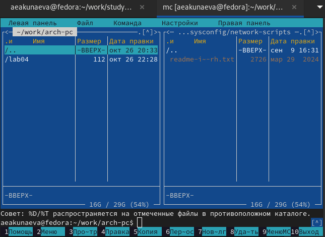
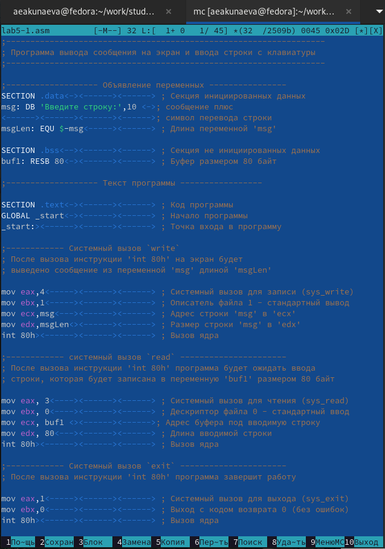
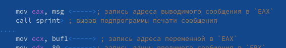

---
## Front matter
title: "Лабораторная работа №5"
subtitle: "Основы работы с Midnight Commander (mc). Структура программы на языке ассемблера NASM. Системные вызовы в ОС GNU Linux"
author: "Акунаева Антонина Эрдниевна"

## Generic otions
lang: ru-RU
toc-title: "Содержание"

## Bibliography
bibliography: bib/cite.bib
csl: pandoc/csl/gost-r-7-0-5-2008-numeric.csl

## Pdf output format
toc: true # Table of contents
toc-depth: 2
lof: true # List of figures
lot: true # List of tables
fontsize: 12pt
linestretch: 1.5
papersize: a4
documentclass: scrreprt
## I18n polyglossia
polyglossia-lang:
  name: russian
  options:
	- spelling=modern
	- babelshorthands=true
polyglossia-otherlangs:
  name: english
## I18n babel
babel-lang: russian
babel-otherlangs: english
## Fonts
mainfont: IBM Plex Serif
romanfont: IBM Plex Serif
sansfont: IBM Plex Sans
monofont: IBM Plex Mono
mathfont: STIX Two Math
mainfontoptions: Ligatures=Common,Ligatures=TeX,Scale=0.94
romanfontoptions: Ligatures=Common,Ligatures=TeX,Scale=0.94
sansfontoptions: Ligatures=Common,Ligatures=TeX,Scale=MatchLowercase,Scale=0.94
monofontoptions: Scale=MatchLowercase,Scale=0.94,FakeStretch=0.9
mathfontoptions:
## Biblatex
biblatex: true
biblio-style: "gost-numeric"
biblatexoptions:
  - parentracker=true
  - backend=biber
  - hyperref=auto
  - language=auto
  - autolang=other*
  - citestyle=gost-numeric
## Pandoc-crossref LaTeX customization
figureTitle: "Рис."
tableTitle: "Таблица"
listingTitle: "Листинг"
lofTitle: "Список иллюстраций"
lotTitle: "Список таблиц"
lolTitle: "Листинги"
## Misc options
indent: true
header-includes:
  - \usepackage{indentfirst}
  - \usepackage{float} # keep figures where there are in the text
  - \floatplacement{figure}{H} # keep figures where there are in the text
---

# Цель работы

Приобретение практических навыков работы в Midnight Commander. Освоение инструкций языка ассемблера mov и int.

# Задание

Научиться работать с файлами и каталогами в Midnight Commander.  
Освоить пользование Midnight Commander при помощи функциональных клавиш.  
Освоить NASM и инструкции языка ассемблера mov, int.  

# Выполнение лабораторной работы

## Midnight Commander

3.1.1. Откройте Midnight Commander.

{#fig:fig1 width=80%}

{#fig:fig2 width=80%}

Откроем MC при помощи команды mc в терминале.

3.1.2. Пользуясь клавишами ↑ , ↓ и Enter перейдите в каталог ~/work/arch-pc созданный при выполнении лабораторной работы №4.

{#fig:fig3 width=80%}

{#fig:fig4 width=80%}

Переходим в требуемый каталог при помощи горячих клавиш.

3.1.3. С помощью функциональной клавиши F7 создайте папку lab05 и перейдите в созданный каталог.

{#fig:fig5 width=80%}

{#fig:fig6 width=80%}

Горячей клавишей F7 создадим каталог и введём его название lab05.

3.1.4. Пользуясь строкой ввода и командой touch создайте файл lab5-1.asm.

{#fig:fig7 width=80%}

{#fig:fig8 width=80%}

При помощи команды touch в текущей директории в терминала окна Midnight Commander создадим файл lab5-1.asm и убедимся в его наличии, проверив визуально в MC.

3.1.5. С помощью функциональной клавиши F4 откройте файл lab5-1.asm для редактирования во встроенном редакторе. Как правило в качестве встроенного редактора Midnight Commander используется редакторы nano или mcedit.

{#fig:fig9 width=80%}

Горячей клавишей F4 откроем файл во встроенном редакторе, по умолчанию на данном устройстве - в mcedit.

3.1.6. Введите текст программы из листинга 5.1 (можно без комментариев), сохраните изменения и закройте файл.

{#fig:fig10 width=80%}

{#fig:fig11 width=80%}

Вставим текст листинга 5.1 из лабораторной в mcedit при помощи зажатой SHIFT + средней кнопки мыши (колёсико). Сохраним изменения горячей клавишей F2 и выйдем из редактора с F10.

3.1.7. С помощью функциональной клавиши F3 откройте файл lab5-1.asm для просмотра. Убедитесь, что файл содержит текст программы.

{#fig:fig12 width=80%}

Нажмём F3 и откроем режим просмотра файла. Проверим корректность проведённых операций и текста листинга 5.1.

3.1.8. Оттранслируйте текст программы lab5-1.asm в объектный файл. Выполните компоновку объектного файла и запустите получившийся исполняемый файл. Программа выводит строку 'Введите строку:' и ожидает ввода с клавиатуры. На запрос введите Ваши ФИО.

{#fig:fig13 width=80%}

Проведём трансляцию файла lab5-1.asm в объектный, скомпонуем его в elf для создания исполняемого файла и запускаем его через обращение ./lab5-1. Объектный и исполняемый файлы сохраняют название .asm файла. После успешного запуска в терминале выводится запрос, на что вводим ФИО.

## Подключение внешнего файла in_out.asm

3.2.1. Скачайте файл in_out.asm со страницы курса в ТУИС.

{#fig:fig14 width=80%}

Скачиваем файл с ТУИС. Файл расположен в Загрузках.

3.2.2. Подключаемый файл in_out.asm должен лежать в том же каталоге, что и файл с программой, в которой он используется.

В одной из панелей mc откройте каталог с файлом lab5-1.asm. В другой панели каталог со скаченным файлом in_out.asm (для перемещения между панелями используйте Tab). Скопируйте файл in_out.asm в каталог с файлом lab5-1.asm с помощью функциональной клавиши F5.

{#fig:fig15 width=80%}

При помощи горячих клавиш перейдём в рабочий каталог ~/work/arch-pc/lab05/ и в каталог с файлом in_out.asm ~/Загрузки.

{#fig:fig16 width=80%}

Функциональной клавишей F5 скопируем файл in_out.asm в рабочий каталог, который выбран в левой панели в Midnight Commander.

{#fig:fig17 width=80%}

После подтверждения действия видим файл in_out.asm в левой панели с рабочим каталогом, где расположен файл lab5-1.asm.

3.2.3. С помощью функциональной клавиши F6 создайте копию файла lab5-1.asm с именем lab5-2.asm. Выделите файл lab5-1.asm, нажмите клавишу F6 , введите имя файла lab5-2.asm и нажмите клавишу Enter.

{#fig:fig18 width=80%}

Функциональной клавишей F6 копируем файл lab5-1.asm в рабочий каталог (та же директория) с указанием нового имени для файла.

3.2.4. Исправьте текст программы в файле lab5-2.asm с использование подпрограмм из внешнего файла in_out.asm (используйте подпрограммы sprintLF, sread и quit) в соответствии с листингом 5.2. Создайте исполняемый файл и проверьте его работу.

{#fig:fig19 width=80%}

Откроем текстовый редактор mcedit в Midnight Commander с файлом lab5-2.asm и исправим исходный текст в соответствии с листингом 5.2. Сохраним при помощи функциональной клавиши F2 и выйдем из редактора с F10.

{#fig:fig20 width=80%}

Оттранслируем lab5-2.asm в объектный файл, скомпонуем и создадим исполняемый файл в elf. Запустим lab5-2. Результат идентичен lab5-1.

3.2.5. В файле lab5-2.asm замените подпрограмму sprintLF на sprint. Создайте исполняемый файл и проверьте его работу. В чем разница?

{#fig:fig21 width=80%}

Изменим строку с sprintLF на sprint.

{#fig:fig22 width=80%}

Снова оттранслируем lab5-2.asm в объектный файл, скомпонуем и создадим исполняемый файл в elf. Запустим lab5-2. В отличие от lab5-1, запрос lab5-2 отличается отсутствием переноса строки после фразы, что обусловлено разницей между командами sprintLF и sprint - первая содержит перенос строки после вывода текста (LF), вторая - нет.

# Описание результатов выполнения заданий для самостоятельной работы

4.1. Создайте копию файла lab5-1.asm. Внесите изменения в программу (без использования внешнего файла in_out.asm), так чтобы она работала по следующему алгоритму:

• вывести приглашение типа “Введите строку:”;

• ввести строку с клавиатуры;

• вывести введённую строку на экран.

{#fig:fig23 width=80%}

Скопируем файл lab5-1.asm при помощи функциональной клавиши F5 и переименуем его в строке пункта назначения в lab5-3.asm.

{#fig:fig24 width=80%}

Т.к. нам не нужно использовать внешний файл in_out.asm, оставляем исходный текст из lab5-1.asm и изменяем/дополняем его в соответствии с требованиями, используя операнды mov, int:

mov eax,4 - системный вызов для записи sys_write;

mov ebx,1 - описатель файла 1 обозначает стандартный вывод;

mov ecx,buf1 - адрес строки buf1 в ecx. Мы используем здесь переменную вводимой ранее строки buf1 (обозначена в .asm-файлах;

mov edx,80 - размер строки в edx. Мы используем значение 80, то же, которое было указано при вводе строки в адрес buf1;

int 80h - вызов ядра.

4.2. Получите исполняемый файл и проверьте его работу. На приглашение ввести строку введите свою фамилию.

{#fig:fig25 width=80%}

Оттранслируем lab5-3.asm в объектный файл, скомпонуем и создадим исполняемый файл в elf. Запустим lab5-3. Введём свою фамилию. Как и требовалось, после ввода фамилии она выводится в терминал.

4.3. Создайте копию файла lab5-2.asm. Исправьте текст программы с использование подпрограмм из внешнего файла in_out.asm, так чтобы она работала по следующему алгоритму:

• вывести приглашение типа “Введите строку:”;

• ввести строку с клавиатуры;

• вывести введённую строку на экран.

{#fig:fig26 width=80%}

Скопируем файл lab5-2.asm при помощи функциональной клавиши F5 и переименуем его в строке пункта назначения в lab5-4.asm.

{#fig:fig27 width=80%}

Т.к. нам нужно использовать внешний файл in_out.asm, оставляем исходный текст из lab5-1.asm и изменяем/дополняем его в соответствии с требованиями, используя разные операнды:

mov eax,buf1 - запись адреса выводимого сообщения из переменной buf1 со значением введённой ранее строки в 'EAX';

call sprint  - вызов подпрограммы вывода сообщения в терминал.

4.4. Создайте исполняемый файл и проверьте его работу.

{#fig:fig28 width=80%}

Оттранслируем lab5-4.asm в объектный файл, скомпонуем и создадим исполняемый файл в elf. Запустим lab5-4. Введём свою фамилию. Как и требовалось, после ввода фамилии она выводится в терминал.

# Выводы

Я приобрела практические навыки работы в Midnight Commander, освоила инструкции языка ассемблера mov и int.
