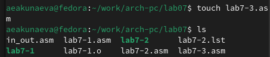
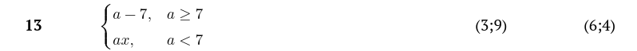

---
## Front matter
title: "Лабораторная работа №7"
subtitle: "Команды безусловного и условного переходов в Nasm. Программирование ветвлений."
author: "Акунаева Антонина Эрдниевна"

## Generic otions
lang: ru-RU
toc-title: "Содержание"

## Bibliography
bibliography: bib/cite.bib
csl: pandoc/csl/gost-r-7-0-5-2008-numeric.csl

## Pdf output format
toc: true # Table of contents
toc-depth: 2
lof: true # List of figures
lot: true # List of tables
fontsize: 12pt
linestretch: 1.5
papersize: a4
documentclass: scrreprt
## I18n polyglossia
polyglossia-lang:
  name: russian
  options:
	- spelling=modern
	- babelshorthands=true
polyglossia-otherlangs:
  name: english
## I18n babel
babel-lang: russian
babel-otherlangs: english
## Fonts
mainfont: IBM Plex Serif
romanfont: IBM Plex Serif
sansfont: IBM Plex Sans
monofont: IBM Plex Mono
mathfont: STIX Two Math
mainfontoptions: Ligatures=Common,Ligatures=TeX,Scale=0.94
romanfontoptions: Ligatures=Common,Ligatures=TeX,Scale=0.94
sansfontoptions: Ligatures=Common,Ligatures=TeX,Scale=MatchLowercase,Scale=0.94
monofontoptions: Scale=MatchLowercase,Scale=0.94,FakeStretch=0.9
mathfontoptions:
## Biblatex
biblatex: true
biblio-style: "gost-numeric"
biblatexoptions:
  - parentracker=true
  - backend=biber
  - hyperref=auto
  - language=auto
  - autolang=other*
  - citestyle=gost-numeric
## Pandoc-crossref LaTeX customization
figureTitle: "Рис."
tableTitle: "Таблица"
listingTitle: "Листинг"
lofTitle: "Список иллюстраций"
lotTitle: "Список таблиц"
lolTitle: "Листинги"
## Misc options
indent: true
header-includes:
  - \usepackage{indentfirst}
  - \usepackage{float} # keep figures where there are in the text
  - \floatplacement{figure}{H} # keep figures where there are in the text
---

# Цель работы

Изучение команд условного и безусловного переходов. Приобретение навыков написания программ с использованием переходов. Знакомство с назначением и структурой файла листинга.

# Задание

Научиться реализовывать переходы в NASM.  
Изучить структуры файлы листинга.  

# Выполнение лабораторной работы

## Реализация переходов в NASM

3.1.1. Создайте каталог для программам лабораторной работы № 7, перейдите в него и создайте файл lab7-1.asm.

{#fig:fig1 width=80%}

Создадим каталог lab07 в рабочем каталоге при помощи mkdir, перейдём в него с cd. В новом каталоге создадим NASM-файл lab7-1.asm при помощи touch.

3.1.2. Введите в файл lab7-1.asm текст программы из листинга 7.1. Создайте исполняемый файл и запустите его. Результат работы данной программы будет следующим:

user@dk4n31:~$ ./lab7-1

Сообщение № 2

Сообщение № 3

user@dk4n31:~$

{#fig:fig2 width=80%}

{#fig:fig3 width=80%}

Откроем файл lab7-1.asm в mcedit. Скопируем текст листинга 7.1 в файл и сохраним. Затем оттранслируем, скомпонуем и запустим исполняемый файл lab7-1. Результат совпадает с предложенным в примере, потому что, несмотря на наличие в листинге сообщения 1, команда jmp _label2 пропускает первое и переходит сразу ко второму сообщению.

Измените текст программы в соответствии с листингом 7.2. Создайте исполняемый файл и проверьте его работу.

{#fig:fig4 width=80%}

{#fig:fig5 width=80%}

Скопируем текст листинга 7.2 в файл и сохраним. Затем оттранслируем, скомпонуем и запустим исполняемый файл lab7-1. Как и до этого, программа начинает с сообщения 2 из-за команды jmp _label2, но в секции с сообщением 2 есть команда jmp _label1,  потому выводится первое сообщение, а затем осуществляется переход в jmp _end, и программа завершает работу.

Измените текст программы добавив или изменив инструкции jmp, чтобы вывод программы был следующим:

user@dk4n31:~$ ./lab7-1

Сообщение № 3

Сообщение № 2

Сообщение № 1

user@dk4n31:~$

{#fig:fig6 width=80%}

{#fig:fig7 width=80%}

Изменим первый jmp на jmp _label3, тогда начинаем с третьего сообщения, в нём запишем команду jmp _label2, выводится второе, оставляем остальное, как есть, тогда следующим выводится сообщение 1 и программа завершает работу.

3.1.3. Создайте файл lab7-2.asm в каталоге ~/work/arch-pc/lab07. Внимательно изучите текст программы из листинга 7.3 и введите в lab7-2.asm. Создайте исполняемый файл и проверьте его работу для разных значений B.

{#fig:fig8 width=80%}

Создадим файл lab7-2.asm при помощи touch в текущей директории.

{#fig:fig9 width=80%}

{#fig:fig10 width=80%}

Скопируем текст из листинга 7.3 в файл lab7-2.asm, открыв его в mcedit.

{#fig:fig11 width=80%}

Запустм исполняемый файл lab7-2 несколько раз и проверим разные знаачения B. Так как по умолчанию А = 20, С = 50, то первое максимальное значение будет 50 (при В = 12), второе - 100 (В = 100), третье - 50 (В = 30).

## Изучение структуры файлы листинга

3.2.1. Создайте файл листинга для программы из файла lab7-2.asm. Откройте файл листинга lab7-2.lst с помощью любого текстового редактора, например mcedit. Внимательно ознакомиться с его форматом и содержимым. Подробно объяснить содержимое трёх строк файла листинга по выбору.

{#fig:fig12 width=80%}

Создадим листинг для lab7-2.asm, указав ключ -l и задав название файла листинга lab7-2.lst.

{#fig:fig13 width=80%}

Откроем листинг в текстовом редакторе при помощи mcedit. Изучим содержимое: в листинге указан наш код программы и пояснение слева в машинном коде.

Строка 115: адрес в сегменте кода 0000008С, машинный код В80А000000, команда из текста файла .asm mov eax, 0Ah - присвоение eax значения 0Ah по таблице ASCII.

Строка 116: адрес в сегменте кода 00000091, машинный код 50, команда из текста файла .asm push eax - позволяет сохранить начальные данные регистров при старте программы с последующим восстановлением.

Строка 117: адрес в сегменте кода 00000092, машинный код 89Е0, команда из текста файла .asm mov eax,esp - присвоение переменной eax значения из esp.

Откройте файл с программой lab7-2.asm и в любой инструкции с двумя операндами удалить один операнд. Выполните трансляцию с получением файла листинга. Какие выходные файлы создаются в этом случае? Что добавляется в листинге?

{#fig:fig14 width=80%}

{#fig:fig15 width=80%}

{#fig:fig16 width=80%}

Удалим операнд 10 в mov edx, 10. Попробуем оттранслировать файл, но отобразится ошибка, т.к. не хватает операнда. Тем не менее листинг создан, откроем его и просмотрим. В строке 19 листинга появляется текст ошибки, которая выводится на экран.

# Описание результатов выполнения заданий для самостоятельной работы

4.1. Напишите программу нахождения наименьшей из 3 целочисленных переменных a, b и c. Значения переменных выбрать из табл. 7.5 в соответствии с вариантом, полученным
при выполнении лабораторной работы №6. Создайте исполняемый файл и проверьте его работу.

Вариант 13 из предыдущей лабораторной. Значения 84, 32, 77.

{#fig:fig17 width=80%}

{#fig:fig18 width=80%}

Напишем программу нахождения минимального значения из 3-ёх переменных.

{#fig:fig19 width=80%}

Создадим и запустим исполняемый файл. Программа успешно выводит наименьшее значение 32.

4.2. Напишите программу, которая для введенных с клавиатуры значений x и a вычисляет значение заданной функции f(x) и выводит результат вычислений. Вид функции f(x) выбрать из таблицы 7.6 вариантов заданий в соответствии с вариантом, полученным при выполнении лабораторной работы №6. Создайте исполняемый файл и проверьте его работу для значений x и a из 7.6.

Вариант 13 из предыдущей лабораторной.

{#fig:fig20 width=80%}

{#fig:fig21 width=80%}

{#fig:fig22 width=80%}

{#fig:fig23 width=80%}

Напишем программу нахождения значения функции для вводимых с клавиатуры переменных.

{#fig:fig24 width=80%}

Создадим и запустим исполняемый файл. Введём значения переменных с клавиатуры. Программа успешно выводит значение функции для заданных x и a.

# Выводы

Я изучила команды условного и безусловного переходов, приобрела навыки написания программ с использованием переходов, познакомилась с назначением и структурой файла листинга.
