---
## Front matter
title: "Лабораторная работа №8"
subtitle: "Программирование цикла. Обработка аргументов командной строки"
author: "Акунаева Антонина Эрдниевна"

## Generic otions
lang: ru-RU
toc-title: "Содержание"

## Bibliography
bibliography: bib/cite.bib
csl: pandoc/csl/gost-r-7-0-5-2008-numeric.csl

## Pdf output format
toc: true # Table of contents
toc-depth: 2
lof: true # List of figures
lot: true # List of tables
fontsize: 12pt
linestretch: 1.5
papersize: a4
documentclass: scrreprt
## I18n polyglossia
polyglossia-lang:
  name: russian
  options:
	- spelling=modern
	- babelshorthands=true
polyglossia-otherlangs:
  name: english
## I18n babel
babel-lang: russian
babel-otherlangs: english
## Fonts
mainfont: IBM Plex Serif
romanfont: IBM Plex Serif
sansfont: IBM Plex Sans
monofont: IBM Plex Mono
mathfont: STIX Two Math
mainfontoptions: Ligatures=Common,Ligatures=TeX,Scale=0.94
romanfontoptions: Ligatures=Common,Ligatures=TeX,Scale=0.94
sansfontoptions: Ligatures=Common,Ligatures=TeX,Scale=MatchLowercase,Scale=0.94
monofontoptions: Scale=MatchLowercase,Scale=0.94,FakeStretch=0.9
mathfontoptions:
## Biblatex
biblatex: true
biblio-style: "gost-numeric"
biblatexoptions:
  - parentracker=true
  - backend=biber
  - hyperref=auto
  - language=auto
  - autolang=other*
  - citestyle=gost-numeric
## Pandoc-crossref LaTeX customization
figureTitle: "Рис."
tableTitle: "Таблица"
listingTitle: "Листинг"
lofTitle: "Список иллюстраций"
lotTitle: "Список таблиц"
lolTitle: "Листинги"
## Misc options
indent: true
header-includes:
  - \usepackage{indentfirst}
  - \usepackage{float} # keep figures where there are in the text
  - \floatplacement{figure}{H} # keep figures where there are in the text
---

# Цель работы

Приобретение навыков написания программ с использованием циклов и обработкой аргументов командной строки.

# Задание

Научиться реализовывать циклы в NASM.  
Научиться обрабатывать аргументы командной строки в NASM.  

# Выполнение лабораторной работы

## Реализация циклов в NASM

3.1.1. Создайте каталог для программам лабораторной работы №6, перейдите в него и создайте файл lab8-1.asm.

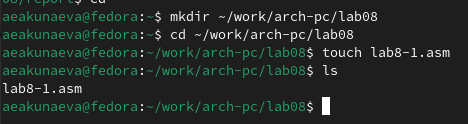{#fig:fig1 width=80%}

Создадим каталог lab08 в рабочем каталоге при помощи mkdir, перейдём в него с cd. В новом каталоге создадим NASM-файл lab8-1.asm при помощи touch.

Внимательно изучите текст программы (Листинг 8.1). Введите в файл lab8-1.asm текст программы из листинга 8.1. Создайте исполняемый файл и проверьте его работу.

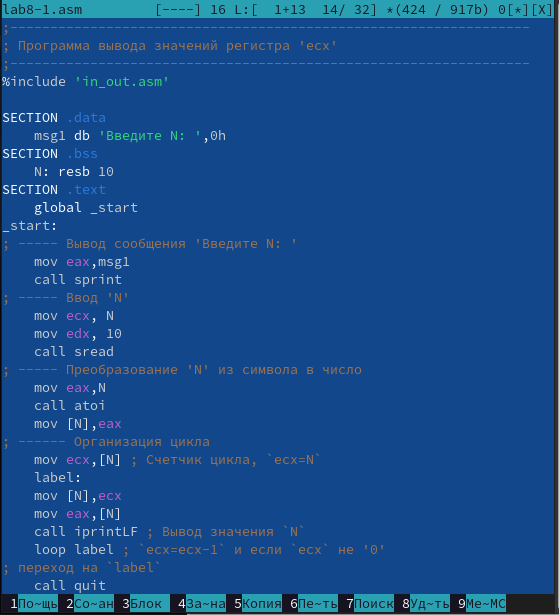{#fig:fig2 width=80%}

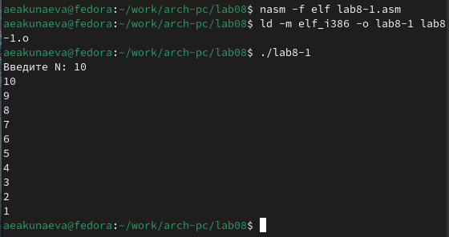{#fig:fig3 width=80%}

Изучим текст листинга 8.1 - в нём описан текст программы для вывода значений регистра 'ecx', используемого в кач-ве счётчика для инструкции цикла loop.

Откроем файл .asm в текстовом редакторе mcedit. Скопируем текст листинга в файл lab8-1.asm и создадим исполняемый файл. Запустим его и получим построчный отсчёт от введённого нами числа до 1.

Измените текст программы добавив изменение значение регистра ecx в цикле.

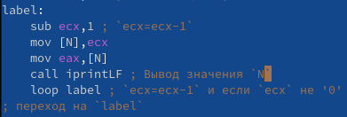{#fig:fig4 width=80%}

Снова откроем в mcedit lab8-1.asm и отредактируем строки в теле label. Мы добавляем одну строку sub ecx,1 в цикл, который дополнительно изменяет ecx.

Создайте исполняемый файл и проверьте его работу. Какие значения принимает регистр ecx в цикле? Соответствует ли число проходов цикла значению N введенному с клавиатуры?

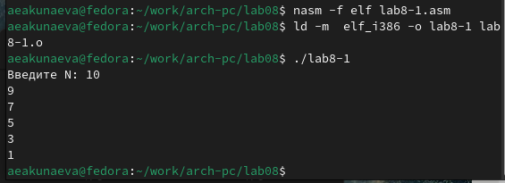{#fig:fig5 width=80%}

Оттранслируем и создадим исполняемый файл, запустим его и получим в результате не числа от 1 до 10, а только нечётные. Это происходит из-за добавленной строки, т.к. дополнительно к действию цикла над регистром ecx отнимается ещё 1. Программа работает, однако количество проходовцикла не совпадает значению введённого N.

Внесите изменения в текст программы добавив команды push
и pop (добавления в стек и извлечения из стека) для сохранения значения счетчика цикла loop.

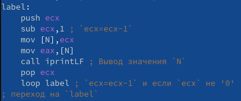{#fig:fig6 width=80%}

Внесём в текст программы ещё одни изменения - добавим стек. Другими словами, будем добавлять значение регистра ecx в стек, специальную структуру данных для хранения, а потом извлекать ecx из стека.

Создайте исполняемый файл и проверьте его работу. Соответствует ли в данном случае число проходов цикла значению N введённому с клавиатуры?

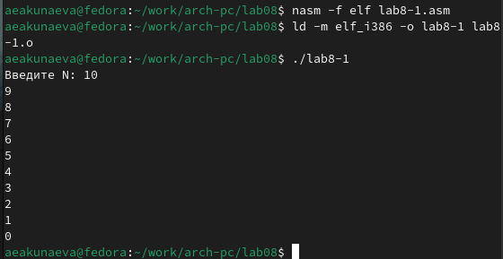{#fig:fig7 width=80%}

Запустим новый исполняемый файл и получим уже 10 проходов цикла, как и было указано в числе N, однако счёт начинается с 9 и заканчивается 0, вместо 10 и 1, т.к. в цикл передаётся сохранённое значение ecx 10б из него отнимается 1 и печатается на экран и т.д.

## Обработка аргументов командной строки

3.2.1. Внимательно изучите текст программы (Листинг 8.2). Создайте файл lab8-2.asm в каталоге ~/work/arch-pc/lab08 и введите в него текст программы из листинга 8.2.

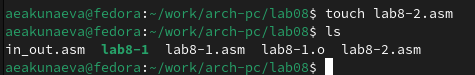{#fig:fig8 width=80%}

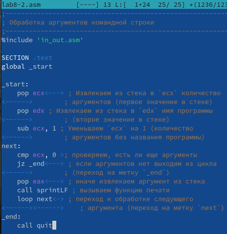{#fig:fig9 width=80%}

Ознакомимся с листингом 8.2 - программа, выводящая на экран аргументы командной строки. Создадим NASM-файл lab8-2.asm при помощи touch в текущей директории. Скопируем в него текст листинга 8.2.

Создайте исполняемый файл и запустите его, указав аргументы. Сколько аргументов было обработано программой?

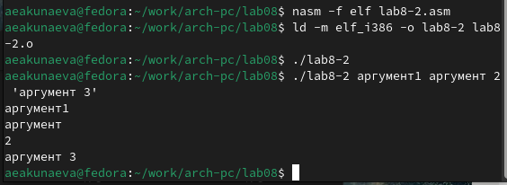{#fig:fig10 width=80%}

Запустим созданный исполняемый файл и проверим его работу. При вводе различных аргументов через пробел выводятся 4 аругмента (те, которые были указаны через пробел, а не логические).

Создайте файл lab8-3.asm в каталоге ~/work/arch-
pc/lab08 и введите в него текст программы из листинга 8.3.

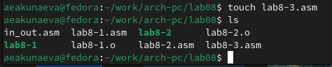{#fig:fig11 width=80%}

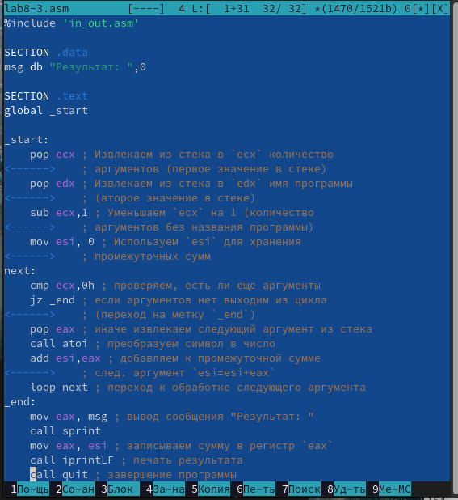{#fig:fig12 width=80%}

Создадим NASM-файл lab8-3.asm при помощи touch в текущей директории. Скопируем в него текст листинга 8.3.

Создайте исполняемый файл и запустите его, указав аргументы.

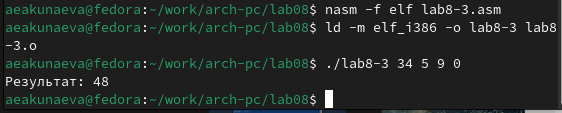{#fig:fig13 width=80%}

Запустим созданный исполняемый файл и проверим его работу. Всё выполянется корректно: программа выводит сумму введённых аргументов.

Измените текст программы из листинга 8.3 для вычисления произведения аргументов командной строки.

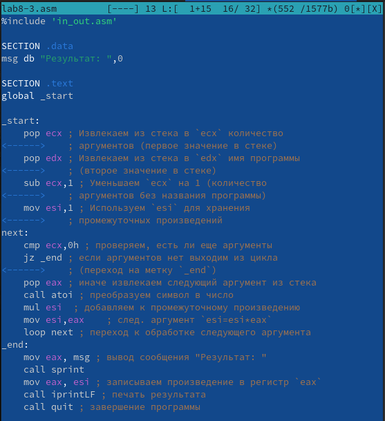{#fig:fig14 width=80%}

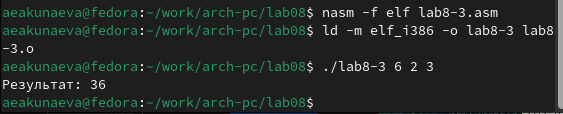{#fig:fig15 width=80%}

Изменим строку add esi,eax на mul esi(чтобы eax*esi) и добавим строку mov esi,eax, чтобы сохранить в esi значение промежуточного произведения и изменим начальное значение esi на 1 вместо 0. Запустим созданный исполняемый файл и проверим его работу. Всё выполянется корректно: программа выводит произведение введённых аргументов.

# Описание результатов выполнения заданий для самостоятельной работы

4.1. Напишите программу, которая находит сумму значений функции f(x) для x = x1, x2, ..., xn, т.е. программа должна выводить значение f(x1) + f(x2) + ... + f(xn). Значения xi передаются как аргументы. Вид функции f(x) выбрать из таблицы 8.1 вариантов заданий в соответствии с вариантом, полученным при выполнении лабораторной работы №6. Создайте исполняемый файл и проверьте его работу на нескольких наборах x = x1, x2, ..., xn.

Вариант 13. f(x)=12x-7

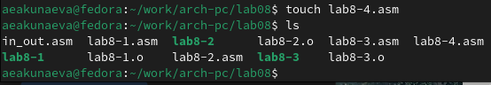{#fig:fig16 width=80%}

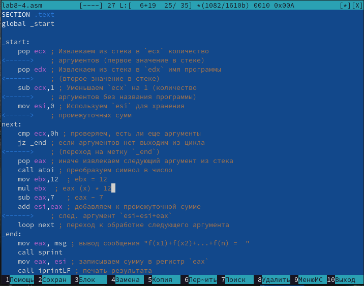{#fig:fig17 width=80%}

Создадим NASM-файл lab8-4.asm при помощи touch в текущей директории. Запишем в него текст программы, соответствующей условию со значениями и функцией из варианта 13.

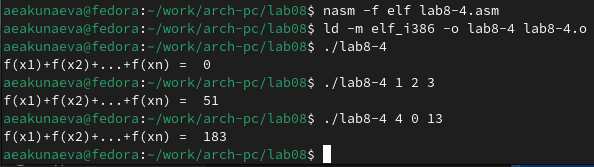{#fig:fig18 width=80%}

Оттранслируем объектный файл и создадим исполняемый, запустим его. В результате выводится сумма значений функции f(x) = 12x-7 при разных введённых аргументах.

# Выводы

Я приобрела навыки написания программ с использованием циклов и обработкой аргументов командной строки.
