---
## Front matter
title: "Лабораторная работа №6"
subtitle: "Арифметические операции в NASM"
author: "Акунаева Антонина Эрдниевна"

## Generic otions
lang: ru-RU
toc-title: "Содержание"

## Bibliography
bibliography: bib/cite.bib
csl: pandoc/csl/gost-r-7-0-5-2008-numeric.csl

## Pdf output format
toc: true # Table of contents
toc-depth: 2
lof: true # List of figures
lot: true # List of tables
fontsize: 12pt
linestretch: 1.5
papersize: a4
documentclass: scrreprt
## I18n polyglossia
polyglossia-lang:
  name: russian
  options:
	- spelling=modern
	- babelshorthands=true
polyglossia-otherlangs:
  name: english
## I18n babel
babel-lang: russian
babel-otherlangs: english
## Fonts
mainfont: IBM Plex Serif
romanfont: IBM Plex Serif
sansfont: IBM Plex Sans
monofont: IBM Plex Mono
mathfont: STIX Two Math
mainfontoptions: Ligatures=Common,Ligatures=TeX,Scale=0.94
romanfontoptions: Ligatures=Common,Ligatures=TeX,Scale=0.94
sansfontoptions: Ligatures=Common,Ligatures=TeX,Scale=MatchLowercase,Scale=0.94
monofontoptions: Scale=MatchLowercase,Scale=0.94,FakeStretch=0.9
mathfontoptions:
## Biblatex
biblatex: true
biblio-style: "gost-numeric"
biblatexoptions:
  - parentracker=true
  - backend=biber
  - hyperref=auto
  - language=auto
  - autolang=other*
  - citestyle=gost-numeric
## Pandoc-crossref LaTeX customization
figureTitle: "Рис."
tableTitle: "Таблица"
listingTitle: "Листинг"
lofTitle: "Список иллюстраций"
lotTitle: "Список таблиц"
lolTitle: "Листинги"
## Misc options
indent: true
header-includes:
  - \usepackage{indentfirst}
  - \usepackage{float} # keep figures where there are in the text
  - \floatplacement{figure}{H} # keep figures where there are in the text
---

# Цель работы

Освоение арифметических инструкций языка ассемблера NASM.

# Задание

Научиться работать с численными и символьными данными в NASM.  
Освоить команды для операций над числами в NASM.  

# Выполнение лабораторной работы

## Символьные и численные данные в NASM

3.1.1. Создайте каталог для программам лабораторной работы №6, перейдите в него и создайте файл lab6-1.asm.

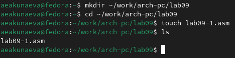{#fig:fig1 width=80%}

Создадим каталог lab06 в рабочем каталоге при помощи mkdir, перейдём в него с cd. В новом каталоге создадим NASM-файл lab6-1.asm при помощи touch.

3.1.2. Рассмотрим примеры программ вывода символьных и численных значений. Программы будут выводить значения записанные в регистр eax.

Введите в файл lab6-1.asm текст программы из листинга 6.1. Создайте исполняемый файл и запустите его.

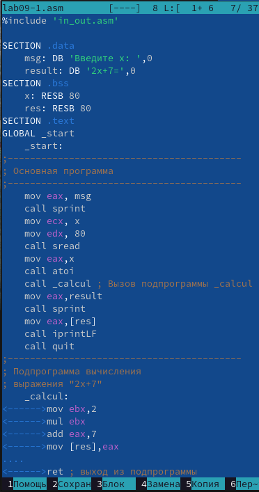{#fig:fig2 width=80%}

Откроем Midnight Commander (mc) в текущей директории и функциональной клавишей F4 откроем файл lab6-1.asm в текстовом редакторе mcedit.

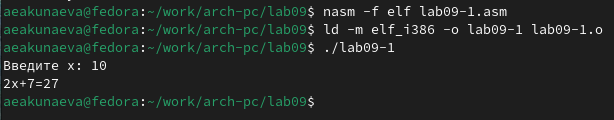{#fig:fig3 width=80%}

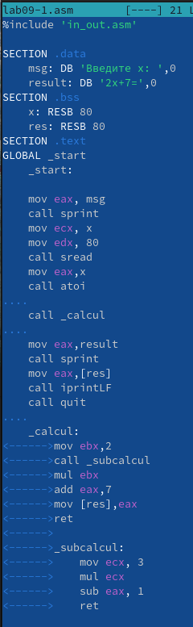{#fig:fig4 width=80%}

Скопируем текст листинга 6.1 в файл и сохраним. Затем оттранслируем, скомпонуем и запустим исполняемый файл lab6-1. Результатом будет один символ 'j', т.к. мы получили его номер в ASCII (всё с предварительным копированием файла in_out.asm в каталог с исполняемым файлом, т.к. в файле обращаемся к нему).

3.1.3. Исправьте текст программы (Листинг 6.1) следующим образом: 

замените строки

mov eax,'6'

mov ebx,'4'

на строки

mov eax,6

mov ebx,4

Создайте исполняемый файл и запустите его.

Пользуясь таблицей ASCII определите какому символу соответствует код 10. Отображается ли этот символ при выводе на экран?

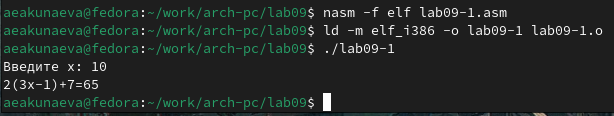{#fig:fig5 width=80%}

Внесём необходимые изменения, убрав кавычки у чисел.

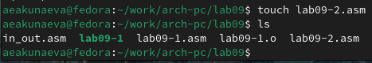{#fig:fig6 width=80%}

Создадим и запустим новый исполняемый файл lab6-1. Выводится символом с кодом 10 - '\n', другими словами - перевод строки, что подтверждается в таблице ASCII.

3.1.4. Создайте файл lab6-2.asm в каталоге ~/work/arch-pc/lab06 и введите в него текст программы из листинга 6.2.

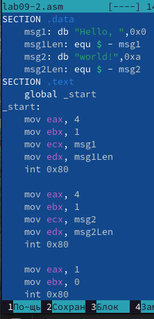{#fig:fig7 width=80%}

При помощи команды touch создадим файл lab6-2.asm.

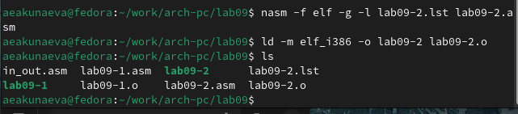{#fig:fig8 width=80%}

Скопируем данные из листинга 6.2 в файл lab6-2.asm, открыв его в mcedit (Midnight Commander).

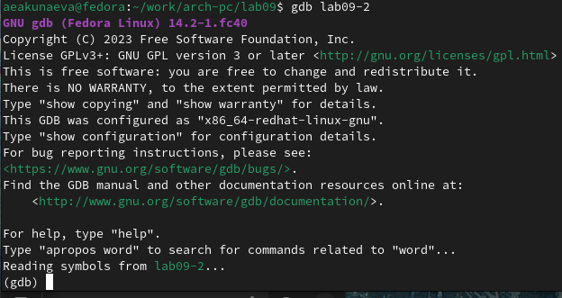{#fig:fig9 width=80%}

Снова создадим исполняемый файл с предварительной трансляцией и компоновкой, после запустим. Мы получили число 106.

3.1.5. Аналогично предыдущему примеру изменим символы на числа. Замените строки

mov eax,'6'

mov ebx,'4'

на строки

mov eax,6

mov ebx,4

Создайте исполняемый файл и запустите его. Какой результат будет получен при исполнении программы?

Замените функцию iprintLF на iprint. Создайте исполняемый файл и запустите его. Чем отличается вывод функций iprintLF и iprint?

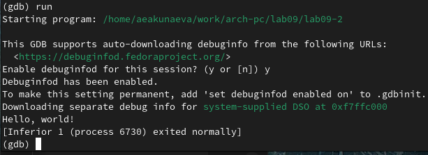{#fig:fig10 width=80%}

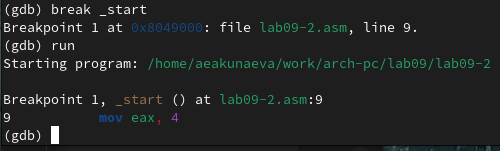{#fig:fig11 width=80%}

В редакторе проведём необходимые изменения и создадим исполняемый файл, который затем запустим. В результате получаем число 10.

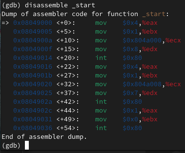{#fig:fig12 width=80%}

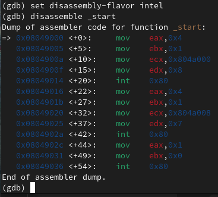{#fig:fig13 width=80%}

В редакторе проведём необходимые изменения и создадим исполняемый файл, который затем запустим. В результате получаем число 10, но уже без переноса строки в конце, т.к. iprintLF, в отличие от iprint, сопровождает строку в конце переносом.

## Выполнение арифметических операций в NASM

3.2.1. В качестве примера выполнения арифметических операций в NASM приведем программу вычисления арифметического выражения 𝑓(𝑥) = (5 ∗ 2 + 3)/3.

Создайте файл lab6-3.asm в каталоге ~/work/arch-pc/lab06.

Внимательно изучите текст программы из листинга 6.3 и введите в lab6-3.asm.

Создайте исполняемый файл и запустите его. Результат работы программы должен быть следующим:

user@dk4n31:~$ ./lab6-3

Результат: 4

Остаток от деления: 1

user@dk4n31:~$

Измените текст программы для вычисления выражения  𝑓(𝑥) = (4 ∗ 6 + 2)/5. Создайте исполняемый файл и проверьте его работу.

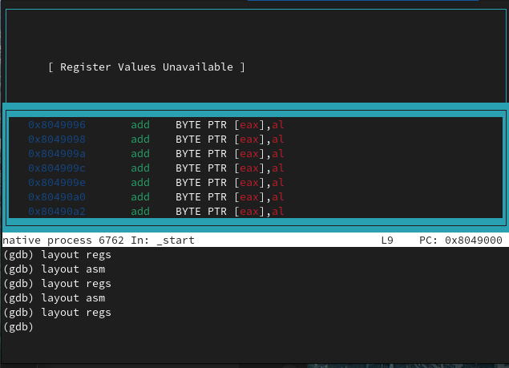{#fig:fig14 width=80%}

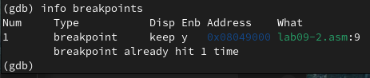{#fig:fig15 width=80%}

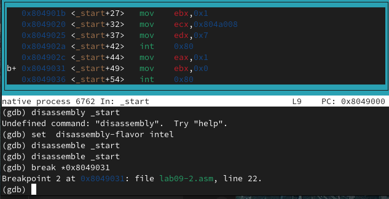{#fig:fig16 width=80%}

С помощью команды touch создаём lab6-3.asm. В редакторе введём в него данные из листинга 6.3, предварительно изучив его содержание, и создадим исполняемый файл, который затем запустим. Результат совпадает с описанным в примере.

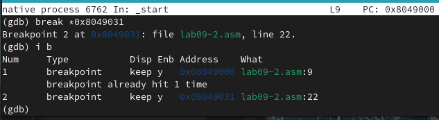{#fig:fig17 width=80%}

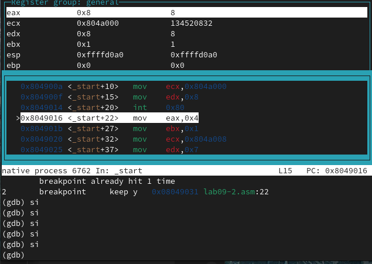{#fig:fig18 width=80%}

Изменим выражение в редакторе в файле lab6-3.asm соответственно требованиям и запустим заново созданный исполняемый файл. В результате получаем верный для нового выражения ответ.

3.2.2. В качестве другого примера рассмотрим программу вычисления варианта задания по номеру студенческого билета, работающую по следующему алгоритму:

• вывести запрос на введение № студенческого билета

• вычислить номер варианта по формуле: (𝑆𝑛 mod 20) + 1, где 𝑆𝑛 – номер студенческого билета (В данном случае 𝑎 mod 𝑏 – это остаток от деления 𝑎 на 𝑏).

• вывести на экран номер варианта. В данном случае число, над которым необходимо проводить арифметические операции, вводится с клавиатуры.

Создайте файл variant.asm в каталоге ~/work/arch-pc/lab06:

touch ~/work/arch-pc/lab06/variant.asm

Внимательно изучите текст программы из листинга 6.4 и введите в файл variant.asm.

Создайте исполняемый файл и запустите его. Проверьте результат работы программы, вычислив номер варианта аналитически.

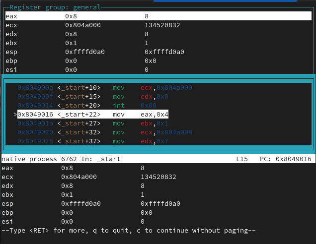{#fig:fig19 width=80%}

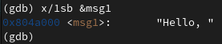{#fig:fig20 width=80%}

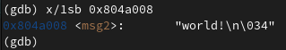{#fig:fig21 width=80%}

С помощью команды touch создаём variant.asm. В редакторе введём в него данные из листинга 6.4, предварительно изучив его содержание, и создадим исполняемый файл, который затем запустим. Результат верен, т.к. остаток от 1032240492 и 20 будет 12, затем + 1 = 13.

Включите в отчет по выполнению лабораторной работы ответы на следующие вопросы:

1. Какие строки листинга 6.4 отвечают за вывод на экран сообщения ‘Ваш вариант:’?

**Ответ:** за вывод отвечают строки

mov eax,rem - назначение адреса rem по 'eax', где rem соответствует строке ‘Ваш вариант:’;

call sprint - вызов подпрограммы вывода в терминал из in_out.asm.

2. Для чего используется следующие инструкции?

mov ecx, x - **Ответ:** назначение адреса x по 'ecx', присваивание переменной x введённого с клавиатуры значения (номер студенческого билета);

mov edx, 80 - **Ответ:** указание размера строки 'edx' = 80;

call sread - **Ответ:** вызов подпрограммы ввода (считывания) с клавиатуры;

3. Для чего используется инструкция “call atoi”?

**Ответ:** инструкция “call atoi” используется для вызова подпрограммы преобразования ASCII кода (строки) в целое число, чтобы не вызывать символы по номерам из таблицы ASCII.

4. Какие строки листинга 6.4 отвечают за вычисления варианта?

**Ответ:** за вычисление варианта отвечают строки

xor edx,edx - команда исключающего ИЛИ, обнуляет edx (размер строки) перед выполнением деления;

mov ebx,20 - назначение регистра ebx = 20;

div ebx - команда беззнакового деления eax на ebx с записью частного от деления в eax и остатка - в ebx;

inc edx - команда инкремента (прибавления единицы) к edx.

5. В какой регистр записывается остаток от деления при 
выполнении инструкции “div ebx”?

**Ответ:** остаток от деления записывается в регистр edx.

6. Для чего используется инструкция “inc edx”?

**Ответ:** инструкция “inc edx” позволяет прибавить к значению регистра exd единицу (инкремент).

7. Какие строки листинга 6.4 отвечают за вывод на экран результата вычислений?

**Ответ:** за вывод результата отвечают строки

mov eax,edx - назначение регистра eax = edx;

call iprintLF - вызов подпрограммы вывода с переносом строки.

# Описание результатов выполнения заданий для самостоятельной работы

4.1. Написать программу вычисления выражения 𝑦 = 𝑓(𝑥). Программа должна выводить выражение для вычисления, выводить запрос на ввод значения 𝑥, вычислять заданное выражение в зависимости от введенного 𝑥, выводить результат вычислений.

Вид функции 𝑓(𝑥) выбрать из таблицы 6.3 вариантов заданий в соответствии с номером, полученным при выполнении лабораторной работы. Создайте исполняемый файл и проверьте его работу для значений 𝑥1 и 𝑥2 из 6.3.

При выполнении задания преобразовывать (упрощать) выражения для 𝑓(𝑥) нельзя. При выполнении деления в качестве результата можно использовать только целую часть от деления и не учитывать остаток (т.е. 5 ∶ 2 = 2).

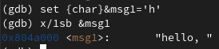{#fig:fig22 width=80%}

С помощью команды touch создаём var13.asm. Из таблицы 6.3 выберем 13-ный вариант: y(x) = (8 * x + 6) * 10 при x1 = 1, x2 = 4.

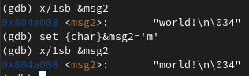{#fig:fig23 width=80%}

В текстовом редакторе (открываем при помощи mcedit var13.asm) mcedit откроем var13.asm и запишем команды согласно заданию. 

Программа будет выводить функцию, а также запрашивать x с клавиатуры. Затем будут проводиться вычисления (умножение mul, сумма add). В конце будет выводиться получившееся при введённом x значение функции y.

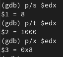{#fig:fig24 width=80%}

Создадим исполняемый файл, предварительно оттранслировав объектный файл и скомпоновав, затем запустим. Введём вместо x значения x1 = 1 и x2 = 4. Если проверить аналитически, результат для x1 и x2 будет верен.

# Выводы

Я освоила арифметические инструкции языка ассемблера NASM.
