---
## Front matter
title: "Лабораторная работа №9"
subtitle: "Понятие подпрограммы. Отладчик GDB."
author: "Акунаева Антонина Эрдниевна"

## Generic otions
lang: ru-RU
toc-title: "Содержание"

## Bibliography
bibliography: bib/cite.bib
csl: pandoc/csl/gost-r-7-0-5-2008-numeric.csl

## Pdf output format
toc: true # Table of contents
toc-depth: 2
lof: true # List of figures
lot: true # List of tables
fontsize: 12pt
linestretch: 1.5
papersize: a4
documentclass: scrreprt
## I18n polyglossia
polyglossia-lang:
  name: russian
  options:
	- spelling=modern
	- babelshorthands=true
polyglossia-otherlangs:
  name: english
## I18n babel
babel-lang: russian
babel-otherlangs: english
## Fonts
mainfont: IBM Plex Serif
romanfont: IBM Plex Serif
sansfont: IBM Plex Sans
monofont: IBM Plex Mono
mathfont: STIX Two Math
mainfontoptions: Ligatures=Common,Ligatures=TeX,Scale=0.94
romanfontoptions: Ligatures=Common,Ligatures=TeX,Scale=0.94
sansfontoptions: Ligatures=Common,Ligatures=TeX,Scale=MatchLowercase,Scale=0.94
monofontoptions: Scale=MatchLowercase,Scale=0.94,FakeStretch=0.9
mathfontoptions:
## Biblatex
biblatex: true
biblio-style: "gost-numeric"
biblatexoptions:
  - parentracker=true
  - backend=biber
  - hyperref=auto
  - language=auto
  - autolang=other*
  - citestyle=gost-numeric
## Pandoc-crossref LaTeX customization
figureTitle: "Рис."
tableTitle: "Таблица"
listingTitle: "Листинг"
lofTitle: "Список иллюстраций"
lotTitle: "Список таблиц"
lolTitle: "Листинги"
## Misc options
indent: true
header-includes:
  - \usepackage{indentfirst}
  - \usepackage{float} # keep figures where there are in the text
  - \floatplacement{figure}{H} # keep figures where there are in the text
---

# Цель работы

Приобретение навыков написания программ с использованием подпрограмм. Знакомство с методами отладки при помощи GDB и его основными возможностями.

# Задание

Научиться реализовывать подпрограммы в NASM.  
Научиться пользоваться отладчиком в GBD.  
Познакомиться с GBD и его возможностями.  

# Выполнение лабораторной работы

## Реализация подпрограмм в NASM

3.1.1. Создайте каталог для программам лабораторной работы №9, перейдите в него и создайте файл lab09-1.asm.

{#fig:fig1 width=80%}

Создадим каталог lab09 в рабочем каталоге при помощи mkdir, перейдём в него с cd. В новом каталоге создадим NASM-файл lab09-1.asm при помощи touch.

3.1.2. Внимательно изучите текст программы (Листинг 9.1). Введите в файл lab09-1.asm текст программы из листинга 9.1. Создайте исполняемый файл и проверьте его работу.

{#fig:fig2 width=80%}

{#fig:fig3 width=80%}

Изучим текст листинга 9.1 - в нём описан текст программы для вычисления выражения 2x+7 при введённом x с использованием подпрограммы. Скопируем текст из листинга 9.1 в файл lab9-1.asm в текстовом редакторе mcedit, создадим исполняемый файл и запустим его. Программа работает корректно.

Измените текст программы, добавив подпрограмму _subcalcul в подпрограмму _calcul, для вычисления выражения f(g(x)), где x вводится с клавиатуры, f(x) = 2x + 7, g(x) = 3x − 1. Т.е. x передается в подпрограмму _calcul из нее в подпрограмму _subcalcul, где вычисляется выражение g(x), результат возвращается в _calcul и вычисляется выражение f(g(x)). Результат возвращается в основную программу для вывода результата на экран.

{#fig:fig4 width=80%}

Впишем подпрограмму подпрограммы _subcalcul в _calcul для выражения x = 3x - 1, которое будет использоваться в f(x) = 2x + 7. Также впишем перед умножением на 2 строку-вызов подпрограммы call _subcalcul.

{#fig:fig5 width=80%}

Создадим и запустим новый исполняемый файл и проверим работу. Программа выполняетяс корректно.
 
## Отладка программам с помощью GDB

3.2.1. Создайте файл lab09-2.asm с текстом программы из Листинга 9.2. (Программа печати сообщения Hello world!).

{#fig:fig6 width=80%}

{#fig:fig7 width=80%}

Создадим при помощи touch файл lab09-2.asm в текущей директории и впишем туда текст листинга 9.2 в mcedit.

Получите исполняемый файл. Для работы с GDB в исполняемый файл необходимо добавить отладочную информацию, для этого трансляцию программ необходимо проводить с ключом ‘-g’.

{#fig:fig8 width=80%}

Оттранслируем объектный файл и создадим исполняемый с использованием ключей -l и названия файла для листинга и -g для добавления отладочной информации.

Загрузите исполняемый файл в отладчик gdb.

{#fig:fig9 width=80%}

Введём gdb lab09-2 для открытия файла в отладчике GBD. Получаем приветственную ознакомительную информацию об отладчике.

Проверьте работу программы, запустив ее в оболочке GDB с помощью команды run (сокращённо r).

{#fig:fig10 width=80%}

Введём команду run. Согласимся на использование debuginfod в этой сессии, чтобы продолжить. Программа выполняется корректно и выводит надпись "Hello, world!" на экран.

Для более подробного анализа программы установите брейкпоинт на метку _start, с которой начинается выполнение любой ассемблерной программы, и запустите её.

{#fig:fig11 width=80%}

Установим брейкпоинт в начале программы, в секции _start, чтобы подробно рассмотреть её. Запустим и получим обозначение брейкпоинта на указанной метке (строке) и ожидания последующих действий.

Посмотрите дисассимилированный код программы с помощью команды disassemble начиная с метки _start.

{#fig:fig12 width=80%}

Введём команду disassemble для начальной метки _start. Получим дисассимилированный (т.е. переведённый на машинный язык) код нашей программы построчно.

Переключитесь на отображение команд с Intel’овским синтаксисом, введя команду set disassembly-flavor intel.

{#fig:fig13 width=80%}

Установим синтаксис, свойственный процессорам Intel, командой set
disassembly-flavor intel. Повторно ведём команду disassemble для начальной метки _start. Получим дисассимилированный код, но уже изменённый под синтаксис Intel.

Перечислите различия отображения синтаксиса машинных команд в режимах ATT и Intel. Включите режим псевдографики для более удобного анализа программы.

{#fig:fig14 width=80%}

Синтаксис машинных команд ATT и Intel различается в:

1. Порядке операндов. В ATT сначала указывается исходный, а затем результирующий, в Intel - наоборот.

2. Обозначение регистров. В ATT перед регистрами указывается символ "%", в Intel может быть "E" или "R".

3. Обозначение адресов. В ATT адреса указываются с использованием скобок и с "$", в Intel - без.

## Добавление точек останова

3.3.1. На предыдущих шагах была установлена точка останова по имени метки (_start). Проверьте это с помощью команды info breakpoints (кратко i b).

{#fig:fig15 width=80%}

Проверим наличие установленной ранее брейкпоинта при помощи info breakpoints в терминале. Точка действительно существует на строке 9 в lab09-2.

Установим еще одну точку останова по адресу инструкции. Адрес инструкции можно увидеть в средней части экрана в левом столбце соответствующей инструкции. Определите адрес предпоследней инструкции (mov ebx,0x0) и установите точку останова.

{#fig:fig16 width=80%}

Найдём предпоследнюю инструкцию программы mov ebx,0x0 с адресом 0x8049031. Назначим брейкпоинт на эту строку через команду break *0x8049031 и проверяем в средней полосе отладчика. Точка успешно установлена.

Посмотрите информацию о всех установленных точках останова.

{#fig:fig17 width=80%}

Введём сокращённую команду i b в терминал gbd и получим список из двух устанвленных нами брейкпоинтов.

## Работа с данными программы в GDB

3.4.1. Выполните 5 инструкций с помощью команды stepi (или si) и проследите за изменением значений регистров. Значения каких регистров изменяются?

{#fig:fig18 width=80%}

Введём пять раз команду si (шаг). Отмечаются активные строки и регистры записываются в верхней части терминала. Изменяются регистры ebx, ecx, edx, eax, eip.

Посмотреть содержимое регистров также можно с помощью команды info registers.

{#fig:fig19 width=80%}

Введём команду info registers и получим список регистров и их содержимое в нижней части терминала.

Посмотрите значение переменной msg1 по имени.

{#fig:fig20 width=80%}

Введём команду x/1sb &msg1 и получим информацию о значении переменной msg1, обратившись к ней по её имени msg1.

Посмотрите значение переменной msg2 по адресу. Посмотрите инструкцию mov ecx,msg2 которая записывает в регистр ecx адрес перемененной msg2.

{#fig:fig21 width=80%}

Введём команду x/1sb 0х804а008 и получим информацию о значении переменной msg2, обратившись к ней по её адресу, который можно найти в списке по дизассемблированной инструкции.

Измените первый символ переменной msg1.

{#fig:fig22 width=80%}

Заменим первый символ переменной msg1 = "Hello, world!" H на h командой set {char}&msg1='h'и проверим результат. x/1sb &msg1 показывает нам нужный результат, надпись с маленькой буквы - "hello, world!".

Замените любой символ во второй переменной msg2.

{#fig:fig23 width=80%}

Тме же образом, но указав в команде msg2 заменим первую букву фразы на m и получим "morld!" в качестве результата.

Выведите в различных форматах (в шестнадцатеричном формате, в двоичном формате и в символьном виде) значение регистра edx.

{#fig:fig24 width=80%}

Просмотрим значения регистра edx в различных форматах при помощи print: p/F $edx (используем форматы s, t, x).

С помощью команды set измените значение регистра ebx.

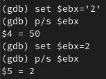{#fig:fig25 width=80%}

Изменим значения регистра ebx командой set $ebx='2' и выведем результат (изменённый регистр) на экран. Затем изменим значение ebx на 2 и снова выведем на экран через print.

Объясните разницу вывода команд p/s $ebx.

Разные значения при выводе объясняются тем, что у значений регистра были разные типы. Так, запись без кавычек присваивает регистру значение 2, а с кавычками - из таблицы ASCII.

Завершите выполнение программы с помощью команды continue (сокращенно c) или stepi (сокращенно si) и выйдите из GDB с помощью команды quit (сокращенно q).

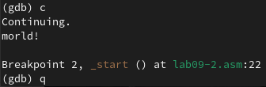{#fig:fig26 width=80%}

Пропишем команду с (continnue), чтобы завершить отладку программы, перейдя к её концу и выйдем из отладчика при помощи q (quit).

## Обработка аргументов командной строки в GDB

3.5.1. Скопируйте файл lab8-2.asm, созданный при выполнении лабораторной работы №8, с программой выводящей на экран аргументы командной строки (Листинг 8.2) в файл с именем lab09-3.asm.

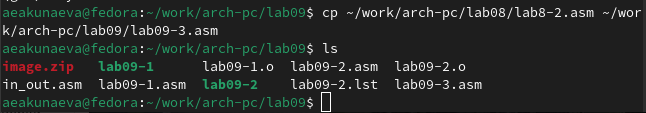{#fig:fig27 width=80%}

Через команду cp скопируем lab8-2.asm в каталог лабораторной работы 9 под новым названием lab09-3.asm, указав его в пункте назначения, относительном пути. Проверим при помощи ls.

Создайте исполняемый файл.

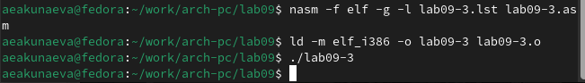{#fig:fig28 width=80%}

Оттранслируем объектный файл и создадим исполняемый с листингом, запустим для проверки.

Загрузите исполняемый файл в отладчик, указав аргументы.

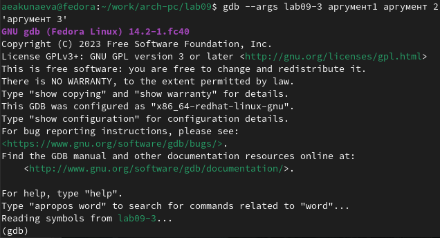{#fig:fig29 width=80%}

Запустим в отладчике gdb файл lab09-3, указав ключ --args, чтобы указать аргументы.

Исследуем расположение аргументов командной строки в стеке после запуска программы с помощью gdb. Для начала установим точку останова перед первой инструкцией в программе и запустим ее.

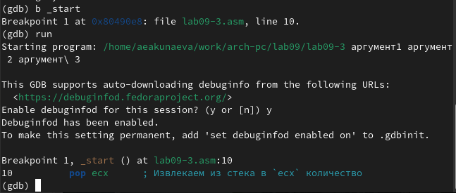{#fig:fig30 width=80%}

Перед запуском программы отметим брейкпоинт на начале программы в _start и затем запустим через run.

Адрес вершины стека хранится в регистре esp и по этому адресу располагается число, равное количеству аргументов командной строки (включая имя программы):

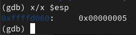{#fig:fig31 width=80%}

Посмотрите остальные позиции стека – по адресу [esp+4] располагается адрес в памяти, где находиться имя программы, по адресу [esp+8] хранится адрес первого аргумента, по адресу [esp+12] – второго и т.д.

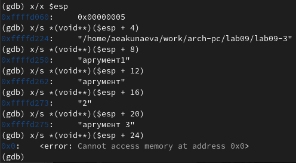{#fig:fig32 width=80%}

Рассмотрим другие позиции стека через обращения к ним в esp с шагом 4 и получим верный результат - сначала идёт название программы (имя) в виде адреса, затем по очереди все 4 аргумента.

Объясните, почему шаг изменения адреса равен 4 ([esp+4], [esp+8], [esp+12] и т.д.).

Шаг изменения адреса равен 4, потому что адресные регистры имеют размерность 4 байта (= 32 бит).

# Описание результатов выполнения заданий для самостоятельной работы

4.1. Преобразуйте программу из лабораторной работы №8 (Задание №1 для самостоятельной работы), реализовав вычисление значения функции f(x) как подпрограмму.

Вариант 13. f(x)=12x-7

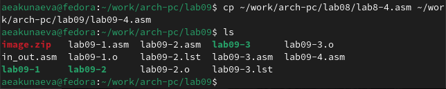{#fig:fig33 width=80%}

Через команду cp скопируем lab8-4.asm с самостоятельной работой 1 из лаб. работы 8 в каталог лабораторной работы 9 под новым названием lab09-4.asm, указав его в пункте назначения, относительном пути. Проверим при помощи ls.

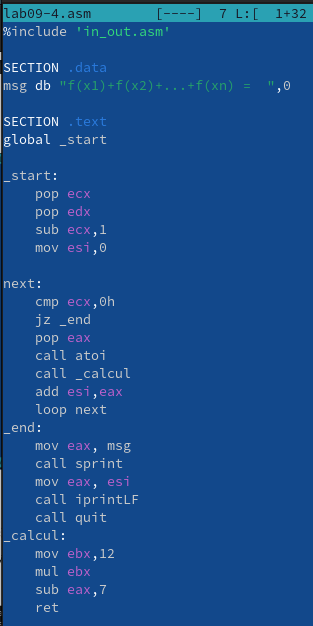{#fig:fig34 width=80%}

Откроем файл lab09-4.asm в текстовом редакторе mcedit Midnight Commander и изменим под использование подпрограммы для реализации вычисления функции. Добавим подпрограмму _calcul и её вызов в теле next.

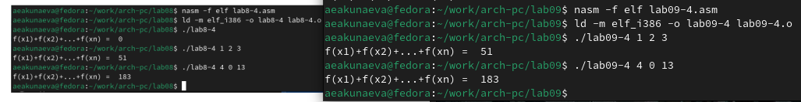{#fig:fig35 width=80%}

Оттранслируем объектный файл и создадим исполняемый для lab09-4.asm. Запустим его, указав аргументы из лабораторной работы 8 ((1,2,3), (4,0,13)) и удостоверимся в корректности работы программы.

4.2. В листинге 9.3 приведена программа вычисления выражения (3 + 2) ∗ 4 + 5. При запуске данная программа дает неверный результат. Проверьте это. С помощью отладчика GDB, анализируя изменения значений регистров, определите ошибку и исправьте ее.

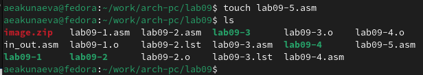{#fig:fig36 width=80%}

Создадим NASM-файл lab09-5.asm при помощи touch в текущей директории.

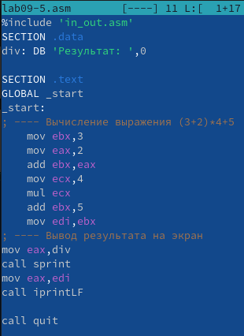{#fig:fig37 width=80%}

Откроем файл lab09-5.asm в текстовом редакторе mcedit и впишем туда текст из листинга 9.3.

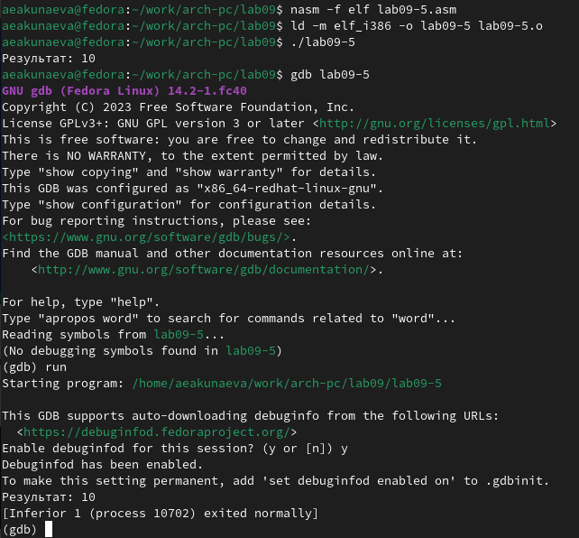{#fig:fig38 width=80%}

Создадим исполняемый файл и проверим работу (выполняется некорректно). Запустим в отладчике gdb файл lab09-5.

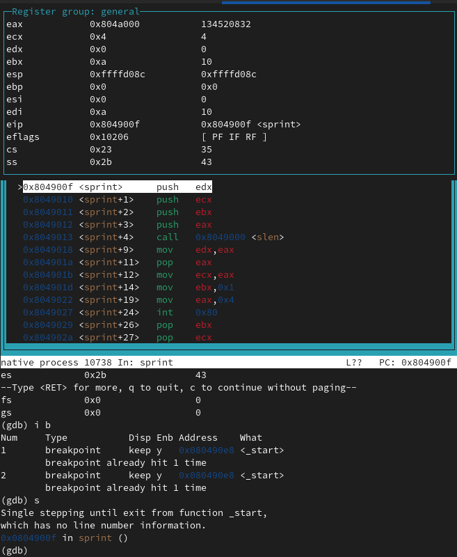{#fig:fig39 width=80%}

Добавим брейкпоинт на начало программы в _start, после чего откроем в layout asm для удобного наблюдения и запустим при помощи run. Осмотрим поэтапно (при помощи команды si) каждый шаг.

Заметим, что регистр ebx изменился лишь дважды - когда к нему прибавили eax = 2 (ebx = 3) и при прибавлении 5 в add ebx,5, что и выводится на экран, хотя остальные операции производились над eax.

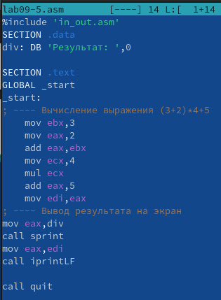{#fig:fig40 width=80%}

Откроем lab09-5.asm в mcedit и отредактируем текст программы так, чтобы к eax прибавляли ebx (и, соответственно, чтобы 5 также прибавляли к eax и в результат записан был он же).

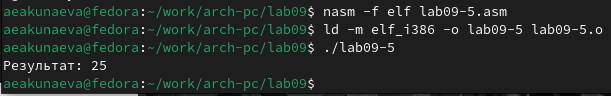{#fig:fig41 width=80%}

Оттранслируем объектный файл и создадим исполняемый для lab09-5.asm. Запустим его и удостоверимся в корректности работы программы.

# Выводы

Я приобрела навыки написания программ с использованием подпрограмм и познакомилась с методами отладки при помощи GDB и его основными возможностями.
