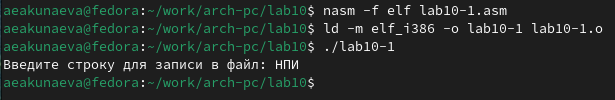

---
## Front matter
title: "Лабораторная работа №10"
subtitle: "Работа с файлами средствами Nasm"
author: "Акунаева Антонина Эрдниевна"

## Generic otions
lang: ru-RU
toc-title: "Содержание"

## Bibliography
bibliography: bib/cite.bib
csl: pandoc/csl/gost-r-7-0-5-2008-numeric.csl

## Pdf output format
toc: true # Table of contents
toc-depth: 2
lof: true # List of figures
lot: true # List of tables
fontsize: 12pt
linestretch: 1.5
papersize: a4
documentclass: scrreprt
## I18n polyglossia
polyglossia-lang:
  name: russian
  options:
	- spelling=modern
	- babelshorthands=true
polyglossia-otherlangs:
  name: english
## I18n babel
babel-lang: russian
babel-otherlangs: english
## Fonts
mainfont: IBM Plex Serif
romanfont: IBM Plex Serif
sansfont: IBM Plex Sans
monofont: IBM Plex Mono
mathfont: STIX Two Math
mainfontoptions: Ligatures=Common,Ligatures=TeX,Scale=0.94
romanfontoptions: Ligatures=Common,Ligatures=TeX,Scale=0.94
sansfontoptions: Ligatures=Common,Ligatures=TeX,Scale=MatchLowercase,Scale=0.94
monofontoptions: Scale=MatchLowercase,Scale=0.94,FakeStretch=0.9
mathfontoptions:
## Biblatex
biblatex: true
biblio-style: "gost-numeric"
biblatexoptions:
  - parentracker=true
  - backend=biber
  - hyperref=auto
  - language=auto
  - autolang=other*
  - citestyle=gost-numeric
## Pandoc-crossref LaTeX customization
figureTitle: "Рис."
tableTitle: "Таблица"
listingTitle: "Листинг"
lofTitle: "Список иллюстраций"
lotTitle: "Список таблиц"
lolTitle: "Листинги"
## Misc options
indent: true
header-includes:
  - \usepackage{indentfirst}
  - \usepackage{float} # keep figures where there are in the text
  - \floatplacement{figure}{H} # keep figures where there are in the text
---

# Цель работы

Приобретение навыков написания программ для работы с файлами.

# Задание

Освоить использование прав пользователей к файлам и каталогам.  
Освоить написание программ для работы с файлами.  

# Выполнение лабораторной работы

## Реализация циклов в NASM

3.1.1. Создайте каталог для программ лабораторной работы №10, перейдите в него и создайте файлы lab10-1.asm, readme-1.txt и readme-2.txt

{#fig:fig1 width=80%}

Создадим каталог lab10 в рабочем каталоге при помощи mkdir, перейдём в него с cd. В новом каталоге создадим NASM-файл lab10-1.asm и текстовые файлы eadme-1.txt и readme-2.txt при помощи touch. Проверим их наличие при помощи команды ls.

3.1.2. Введите в файл lab10-1.asm текст программы из листинга 10.1 (Программа записи в файл сообщения). Создайте исполняемый файл и проверьте его работу.

{#fig:fig2 width=80%}

Откроем lab10-1.asm в текстовом редакторе mcedit (также возможно через Midnight Commander). Впишем текст из листинга 10.1 в файл.

{#fig:fig3 width=80%}

Оттранслируем и запустим исполняемый файл lab10-1. На экран выводится сообщение о вводе строки для записи в файл, после ввода программа заканчивает работу.

3.1.3. С помощью команды chmod измените права доступа к исполняемому файлу lab10-1, запретив его выполнение. Попытайтесь выполнить файл. Объясните результат.

{#fig:fig4 width=80%}

Впишем в терминал команду chmod -x lab10-1. Здесь команда chmod изменяет права пользователей над какими-либо файлами, каталогами; -x это запрет на тип "исполнение"; затем идёт имя файла. В результате было отказано в доступе, т.к. мы запретили выполнение lab10-1.

{#fig:fig5 width=80%}

Если мы попытаемся вернуть права на выполнение программы, заменив -х на +х, то программа снова будет выполняться.

3.1.4. С помощью команды chmod измените права доступа к файлу lab10-1.asm с исходным текстом программы, добавив права на исполнение. Попытайтесь выполнить его и объясните результат.

{#fig:fig6 width=80%}

Добавим права на исполнение для исходного NASM-файла lab10-1.asm через chmod +x lab10-1.asm. Однако при выполнении ничего примечательного не произойдёт, т.к. файл является исходным, а не исполняемым.

3.1.5. В соответствии с вариантом в таблице 10.4 предоставить права доступа к файлу readme1.txt представленные в символьном виде, а для файла readme-2.txt – в двочном виде. Проверить правильность выполнения с помощью команды ls -l.

Вариант 13. -w- --x --- 110 011 001

{#fig:fig7 width=80%}

Введём при помощи команды chmod в символьном виде права для каждого из классов (владелец/пользователь u (user), группа владельца g (group), остальные o (others) с присваиванием =) права согласно указаниям:

-w- - только запись - u=w

--х - только исполнение g=x

--- - отсутствие прав o=

и укажем сам файл readme-1.txt. Затем повторим для readme-2.txt, но с использованием двоичной кодировки. Сверимся с таблицей 10.1 и сопоставим 110 011 001 с 6 3 1, введём их chmod 631 с указанием файла readme-2.txt.

Проверим результат через команду ls -l, чтобы осмотреть права. Заметим, что в порядке владелец-группа-остальные для текстовых файлов и правда права совпадают с указанными нами ранее.

# Описание результатов выполнения заданий для самостоятельной работы

4.1. Напишите программу работающую по следующему алгоритму:

1. Вывод приглашения “Как Вас зовут?”
2. Ввести с клавиатуры свои фамилию и имя
3. Создать файл с именем name.txt
4. Записать в файл сообщение “Меня зовут”
5. Дописать в файл строку введенную с клавиатуры
6. Закрыть файл

Создать исполняемый файл и проверить его работу. Проверить наличие файла и его содержимое с помощью команд ls и cat.

{#fig:fig8 width=80%}

Создадим файл lab10-2.asm при помощи команды touch в текущей директории. Проверим при помощи ls.

{#fig:fig9 width=80%}

{#fig:fig10 width=80%}

Откроем lab10-2.asm в текстовом редакторе mcedit. Составим текст программы, удовлетворяющей условиям.

{#fig:fig11 width=80%}

Оттранслируем и запустим исполняемый файл lab10-2. На экран выводится сообщение "Как Вас зовут?", после чего требуется ввод с клавиатуры. После ввода имени программа завершается. Проверим текущий каталог при помощи ls и заметим новый файл name.txt, который указали в программе. Просмотрим его содержимое при помощи команды cat name.txt, которая выведет содержимое файла на экран - "Меня зовут Тоня". Т.е. программа выполнена корректно: она запрашивает имя и записывает в файл фразу "Меня зовут [Имя]".

# Выводы

Я приобрела навыки написания программ для работы с файлами.
